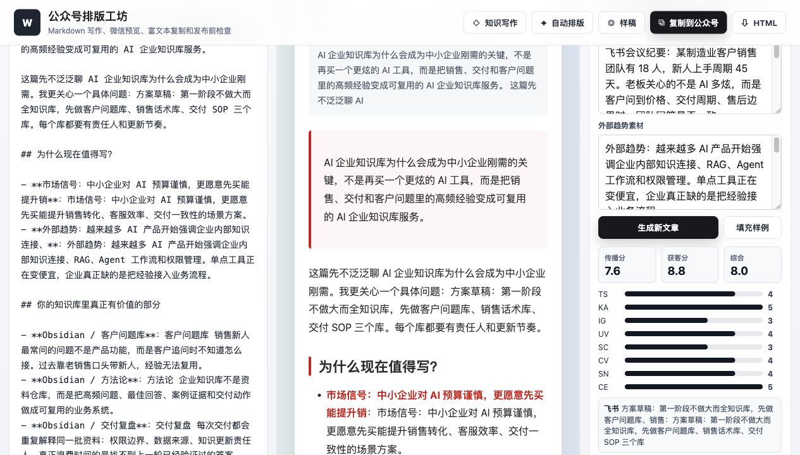

# WeChat Layout Studio / 公众号排版工坊

一个本地可运行的公众号排版工具原型，先解决写作到发布前的最后一公里：

- Markdown 编辑与实时微信宽度预览
- 支持上传 Markdown/TXT/HTML/Word/PDF 文档，支持粘贴或上传图片作为素材
- 8 套公众号友好的内联样式主题
- 复制为公众号后台可粘贴的富文本 HTML
- 一键导出/复制 PNG 图片卡，适合朋友圈、社群和手机端转发
- 粘贴整篇文章后一键自动结构化排版
- 标题、摘要、封面、结构、图片、段落密度发布检查
- 富文本剪贴板清洗成 Markdown
- 本地草稿自动保存
- HTML 导出



## 对标参考

调研和参考了这些方向：

- `doocs/md`：成熟开源标杆，强在 Markdown、扩展语法、图床、AI 助手和草稿管理。
- `xiaobox/mdeditor`：强调现代 UI、多端预览、公众号复制、数学公式、Mermaid 和导出。
- `xiaolinbaba/paper`：单 HTML、本地优先、三栏布局、公众号等宽预览。
- `ksky521/mpeditor`：早期公众号 Markdown 编辑器，重点是实时预览、同步滚动、代码高亮和微信 UI 贴合。
- 用户给的微信文章案例：红色强调线、舒展段距、Mac 风代码块、图片阴影、发布功能说明和参与引导。

## 使用

### 方式一：直接打开

```bash
open wechat-layout-studio/index.html
```

### 方式二：启动本地静态服务

```bash
cd wechat-layout-studio
python3 -m http.server 8765
```

然后访问：

```text
http://127.0.0.1:8765/
```

## 在线部署

这是一个纯静态项目，可以直接部署到 GitHub Pages、Cloudflare Pages、Vercel、Netlify 或任何静态文件服务器。

GitHub Pages 推荐设置：

- Source: `Deploy from a branch`
- Branch: `main`
- Folder: `/ (root)`

## License

MIT
